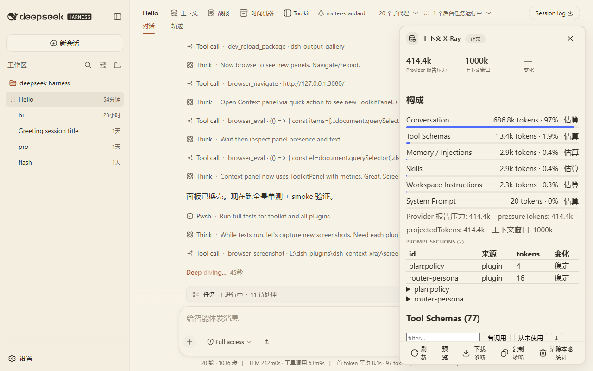
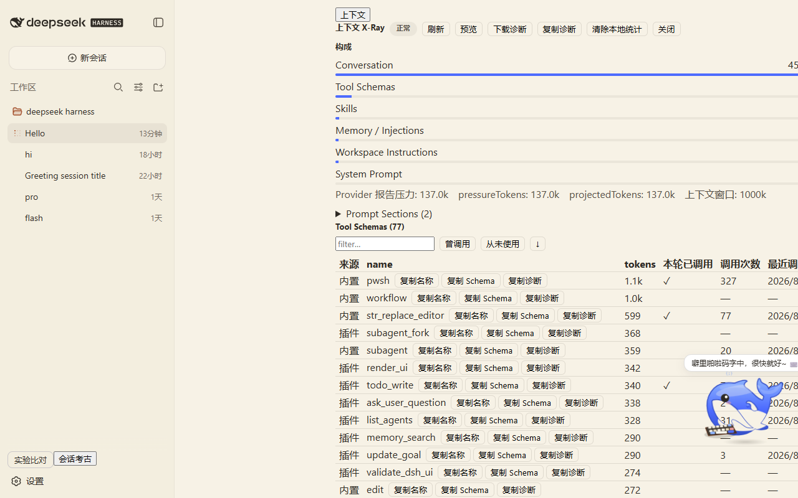

# dsh-context-xray

DSH Context X-Ray：展示模型这一轮真正收到的上下文由什么组成、为什么会这么大。

不是普通 Token Counter。它把 context 拆成 System Prompt / Conversation / Tool Schemas / Skills / Workspace Instructions / Memory / Attachments / Other，并显示 token 估算、占比、turn 间增量和工具级明细。

## Why

DSH 的上下文是黑盒。遇到「上下文太大」「突然接近上限」时，你不知道是系统提示词、工具 schema、历史消息还是 memory 占了大头。

dsh-context-xray 把黑盒拆开：

- 每轮各组成部分占多少 token、占比多少
- 相邻 turn 之间哪里增加最多
- 每个工具 schema 花了多少 token，是否真的被调用过

用于排查上下文膨胀、工具冗余和压力告警。

## Features

- 当前 session 的 Context Breakdown 面板
- Provider 报告的压力与上下文窗口（来自官方 `contextPressure` 投影），按自定义阈值显示 normal/elevated/high/critical 徽标
- Prompt Sections 列表（id / source / order / token 估算 / stable / 预览；正文默认折叠）
- Tool Schema 明细（token、来源、调用次数、最近调用时间、本轮/历史是否调用、搜索、排序）
  - Schema JSON 点击展开预览
  - 操作：复制名称 / 复制 Schema / 复制该工具诊断
- Turn 历史列表（`Turn 41 198k`、`Turn 42 201k +3k`），点击查看该轮 breakdown 及每个 category 的增量说明
- 导出/复制诊断 JSON（不含 prompt 正文，用于提交 issue）
- 清空本地统计

## Screenshots





## Install

前置条件：已安装 DSH CLI（`@deepseek-ai/dsh`），且本机已有目标 profile（示例为 `web`）。

```sh
git clone https://github.com/nzl153/dsh-devtools.git
cd dsh-context-xray
pnpm install
pnpm build
dsh plugin --profile web add link:"$(cygpath -m "$PWD")"
```

装完重启 `dsh web`。之后 client-only 改动走 HMR：

```sh
pnpm dev
```

验证链路：

```sh
pnpm verify:hmr
```

## Usage

1. 安装并重启 DSH
2. 在会话页打开 Context Breakdown 面板（session header actions）
3. 查看总压力、各分类占比、Prompt Sections、Tool Schema 明细
4. 需要排查变化时，打开 Turn history，点击某一 turn 看增量
5. 需要上报问题时，导出诊断 JSON

## Development

```sh
pnpm install
pnpm dev
pnpm test
pnpm build
```

工程命令：

```sh
pnpm typecheck   # tsc --noEmit
pnpm test        # vitest 单测 + jsdom smoke
pnpm build       # tsdown → lib/index.js + lib/client.js
pnpm verify:hmr  # 校验与运行中 DSH 的 HMR 链路
```

HMR 约定：

- client-only 改动：DSH 运行时 HMR 自动生效
- host 改动（`src/host/**`、`package.json` 结构、`cordis.patch.yml`）：需要重启 DSH

## Compatibility

- 测试过的 DSH：`@deepseek-ai/dsh` `0.1.0-rc.6`
- 测试过的 profile：`web`
- 测试过的平台：Windows（Git Bash / MSYS）

未在其他 DSH 版本上验证，不承诺跨版本兼容。

## Privacy

- 所有分析本地完成，不联网
- 完整 prompt 正文不会持久化；`snapshot?includeBody=true` 仅在请求时返回，且不写入 sidecar
- 历史 sidecar 只保存 token/占比/工具名：`~/.dsh/context-xray/<sessionId>.json`
- 诊断导出 JSON 不含任何 prompt 正文（含 DSH 版本、插件版本、context/tool/section 指标与历史）
- `Clear local metrics` 删除该文件

## Security

- 只读诊断，风险等级：Low
- 读取：当前 session 的 context 组成、工具 schema、token 指标
- 写入：仅 `~/.dsh/context-xray/` 下的 sidecar 元数据；不写 Session durable log
- 执行：不执行任何命令
- 不修改 DSH 官方源码，不 monkey-patch 官方 bundle
- 不向 Session durable log 写自定义事件
- 不提供自动禁用工具，只在面板显示徽标

## Limitations

- 工具来源分类（内置/插件/MCP）是名称启发式，可能不准
- 所有 token 明细使用官方启发式（4 字符 ≈ 1 token + 结构开销），不是计费数字
- Provider 总体压力来自官方 `contextPressure`，精确；但分节 token 是估算
- 历史统计仅保留当前运行 DSH 期间的数据，清空即删除

## Roadmap

- 工具来源映射的用户配置（当前为启发式）
- 更精确的 provider 用量字段接入
- 上下文膨胀告警的历史趋势图

以上均未实现。

## License

[MIT](LICENSE)