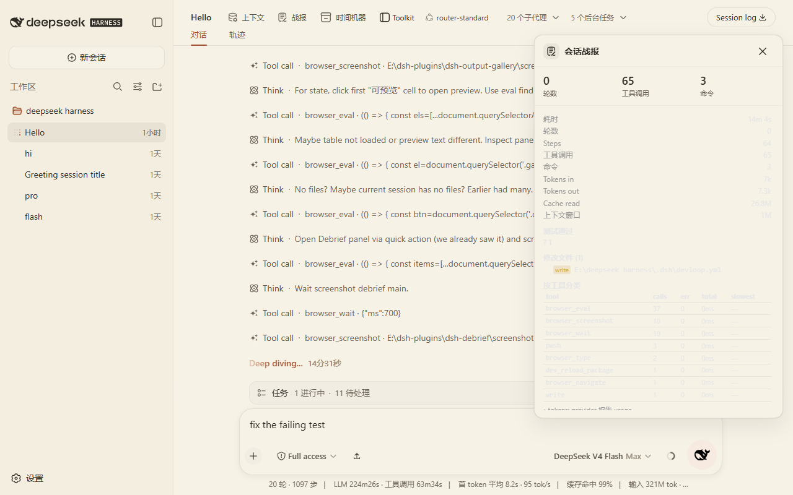
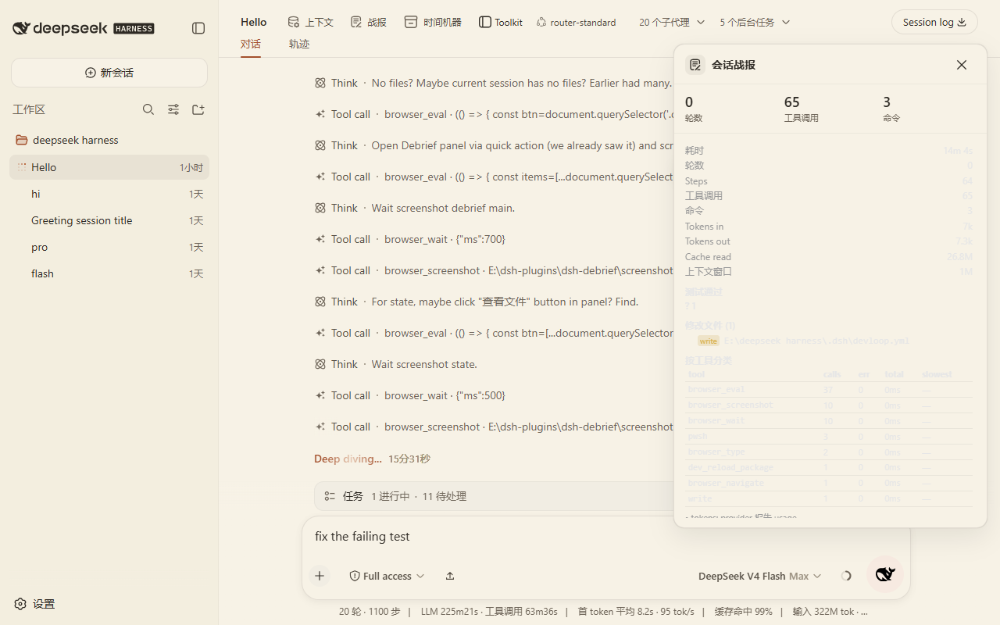

# dsh-debrief

DSH 任务战报：Agent 每完成一轮或一个 session 后，自动生成确定性、非 LLM 的工作摘要。

所有统计在本地从 session event 流计算，不额外调用模型，不解析 UI 文本。

## Why

Agent 跑完一轮，你往往说不清它到底做了什么：跑了什么命令、改了哪些文件、哪些测试没过、token 烧了多少。

dsh-debrief 解决：

- 用本地事件流计算事实，不靠 LLM 总结
- 每轮 / 每 session 自动生成战报卡片
- 失败命令与未解决项一目了然

## Features

- Turn Debrief：一轮的 Duration / Steps / Tool calls / Commands / Tests / Failed commands / 修改文件 / Tokens in-out / 最耗时 tool call，按工具分类统计，未解决项
- Session Debrief：汇聚整个 session 的同类统计，加 Turns 总数与总耗时
- Unresolved 识别：`exit code != 0` 的命令、工具结果带 error、TODO/FIXME 标记
- 测试识别：只在命令匹配用户配置的 `testCommandPatterns`（或内置常见 pattern）时标为 test；拿不到 exit code 时标 `unknown`，绝不猜
- Token / context 统计：来自 `assistant/message` 的 provider usage 与官方 token-meter projection
- 操作：View files、View failed commands、Copy summary、Continue unresolved（生成有界 prompt draft 并插入 composer，不自动执行）
- 触发设置：`off` / `session-only` / `every-n-turns` / `on-completion`，默认低干扰（`session-only`）

## Screenshots





## Install

前置条件：已安装 DSH CLI（`@deepseek-ai/dsh`），且本机已有目标 profile（示例为 `web`）。

```sh
git clone https://github.com/nzl153/dsh-devtools.git
cd dsh-debrief
pnpm install
pnpm build
dsh plugin --profile web add link:"$(cygpath -m "$PWD")"
```

装完重启 `dsh web`。之后 client-only 改动走 HMR：

```sh
pnpm dev
```

验证：

```sh
pnpm verify:hmr
```

## Usage

1. 安装并重启 DSH
2. 默认 `session-only` 模式：turn 尾部出现关闭状态的战报卡片，可展开查看
3. 会话头部打开 Session Debrief 面板查看全量汇总
4. 失败项点击 View failed commands 或 Continue unresolved
5. 需要更高频战报时在设置中改为 `every-n-turns` 或 `on-completion`

设置通过 DSH 设置服务持久化（namespace `debrief`）：

```jsonc
{
  "triggerMode": "session-only",        // off | session-only | every-n-turns | on-completion
  "turnInterval": 2,                    // every-n-turns 时的间隔
  "testCommandPatterns": ["my-test-runner"], // 追加到内置 pattern，识别测试
  "detectTodoMarkers": true
}
```

## Development

```sh
pnpm install
pnpm dev
pnpm test
pnpm build
```

工程命令：

```sh
pnpm typecheck   # tsc --noEmit
pnpm test        # vitest 单测 + jsdom smoke（加载 client bundle）
pnpm test:e2e    # 构造模拟 session event 数组，跑纯 core 并断言（不启动 DSH）
pnpm build       # tsdown → lib/index.js + lib/client.js
pnpm verify:hmr  # 校验与运行中 DSH 的 HMR 链路
```

HMR 约定：

- client-only 改动：DSH 运行时 HMR 自动生效
- host 改动（`src/host/**`、`package.json` 结构、`cordis.patch.yml`）：需要重启 DSH

## API

Host HTTP API（同源校验，`{ ok, value }` / `{ ok, error }` 信封）：

| 端点 | 方法 | 请求体 | 返回 |
|---|---|---|---|
| `/plugins/dsh-debrief/api/turn` | POST | `{ sessionId, turn }` | `TurnDebrief` |
| `/plugins/dsh-debrief/api/session` | POST | `{ sessionId }` | `SessionDebrief` |
| `/plugins/dsh-debrief/api/turns` | POST | `{ sessionId }` | `{ turns: number[] }` |
| `/plugins/dsh-debrief/api/settings` | POST | `{}` | 设置 |

## Compatibility

- 测试过的 DSH：`@deepseek-ai/dsh` `0.1.0-rc.6`
- 测试过的 profile：`web`
- 测试过的平台：Windows（Git Bash / MSYS）

未在其他 DSH 版本上验证，不承诺跨版本兼容。

## Privacy

- 所有分析本地完成，不联网，不调用模型
- 事件日志仅在内存中按 session 保存，`session/disposed` 时释放；不写磁盘 sidecar
- 不向 DSH Session durable log 写自定义事件
- 不修改 DSH 官方源码

## Security

风险等级：Low。

- 读取：session event 流与 provider usage
- 写入：无磁盘 sidecar；通过官方 `inputActions.setDraft()` 插入 composer（不自动执行）
- 执行：不执行命令
- Continue unresolved 生成 prompt draft 后必须用户手动发送
- 识别不了测试就按 command 处理；拿不到 exit code 就标 unknown，不猜

## Limitations

- 修改/读取文件依赖工具是否暴露结构化 path（fs diff meta）或已知工具名启发式；无法覆盖所有三方工具
- test 状态只在有 exit code 或结构化测试结果时给出 passed/failed；无法区分「测试二进制」与「普通失败命令」的语义差异时按 command 处理
- `session-only` / `on-completion` 在 turn-tail 语境无法证明 session 真正结束，因此每个 closed turn 尾部都会显示一个默认折叠的战报卡片（可关闭）；权威的全量摘要仍在 Session 面板
- 事件日志是内存态：重启 DSH 后历史丢失（无持久化）

## Roadmap

- 事件日志持久化 sidecar
- 更完善的三方工具 path 识别
- 测试报告结构化解析（JUnit 等）

以上均未实现。

## License

[MIT](LICENSE)