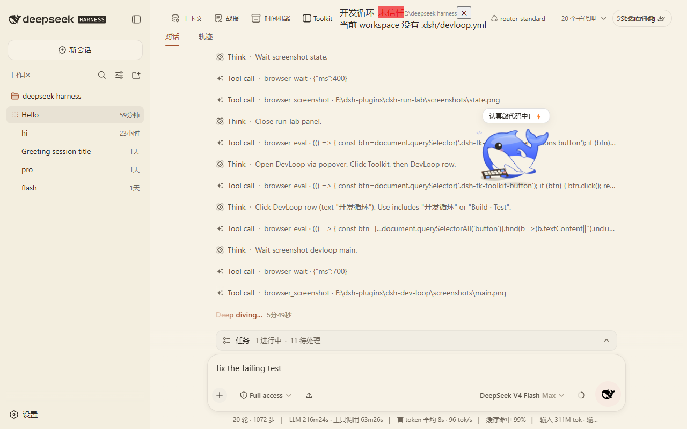

# dsh-dev-loop

项目级 Build / Test / Run / Restart 开发循环面板 for DeepSeek Harness (DSH)。

在 DSH Web 里，基于当前 workspace 的 `.dsh/devloop.yml` 定义动作（build/test/package/run/logs…），一键执行、流式输出、查看退出码/耗时、取消、打开完整日志，并能把最近一次失败输出发送给当前 Agent。

## Why

Agent 改完代码后，需要反复手动跑构建、测试、重启，才能确认项目状态。DSH 内部没有统一的开发循环面板。

dsh-dev-loop 解决：

- 把重复的 build/test/run 动作变成面板按钮
- 输出流式可见，失败可一键发给 Agent
- Watch Mode 和 After Agent Turn 让验证自动化

## Features

- 自动识别当前 workspace，读取其 `.dsh/devloop.yml`
- 动作按钮：Build / Test / Package / Run-Restart / Stop / Open logs
- 每次命令执行：`child_process.spawn` 流式输出、退出码、耗时、可取消
- ANSI 安全渲染（内存中剥离转义序列）、输出最大长度（默认 200k 字符）
- 完整日志本地保存：`~/.dsh/dev-loop/logs/<project>/<timestamp>-<project>-<action>.log`
- secrets redaction：`env` 里 `KEY/TOKEN/SECRET/PASSWORD` 等敏感键的值在输出中替换为 `***`
- Send last error to Agent：把最近一次失败输出（bounded context）经 DSH agent 接口送给当前会话（Agent 不可用时回退为提示复制）
- Trust boundary：命令完全来自 workspace 自身的配置文件，首次执行前需确认信任；信任记录持久化在 `~/.dsh/dev-loop/trust.json`
- 配置支持 `cwd / env / timeout / shell / dependsOn / watch / afterAgent`
- 预设模板：Node / Python / Rust / .NET / Godot —— 只生成 yml，不写死框架
- Watch Mode（默认关闭）：监听路径变化，去抖后自动执行指定 action；内置防无限循环、防重入、queued-latest
- After Agent Turn（默认关闭）：Agent 完成一轮后自动执行指定 action；失败只显示 FAIL，不自动让 Agent 无限修
- Generate preset：面板内生成模板，或 CLI `pnpm preset --framework <fw> --output PATH` 写盘

## Screenshots




## Install

前置条件：已安装 DSH CLI（`@deepseek-ai/dsh`），且本机已有目标 profile（示例为 `web`）。

```sh
git clone https://github.com/nzl153/dsh-devtools.git
cd dsh-dev-loop
pnpm install
pnpm build
dsh plugin --profile web add link:"$(cygpath -m "$PWD")"
```

装完重启 `dsh web`。之后 client-only 改动走 HMR：

```sh
pnpm dev
```

## Usage

1. 在项目根目录创建 `.dsh/devloop.yml`，定义 actions
2. 安装插件并重启 DSH
3. 打开 Dev Loop 面板，首次执行某个动作时确认信任
4. 点击 Build / Test / Run 等按钮
5. 失败时使用 Send last error to Agent

最小配置示例：

```yaml
name: my-app
actions:
  build:
    command: npm run build
  test:
    command: npm test
    dependsOn: [build]
  run:
    command: node .
  logs:
    file: logs/app.log
```

更多示例见 `examples/`。

## Development

```sh
pnpm install
pnpm dev
pnpm dev:client
pnpm test
pnpm build
```

工程命令：

```sh
pnpm typecheck    # tsc --noEmit
pnpm test         # vitest 单测 + client bundle smoke
pnpm build        # 双 half 构建 + verify-build
pnpm verify:hmr   # 校验 profile link / realpath / graph rev 与本地 bundle hash 一致
pnpm preset       # 生成预设模板（--framework node|python|rust|dotnet|godot）
pnpm e2e          # 不启动 DSH 的端到端执行验证（先 build）
```

HMR 约定：

- client-only 改动：DSH 运行时 HMR 自动生效
- host 改动（`src/host/**`、`package.json` 结构、`cordis.patch.yml`）：需要重启 DSH

## Compatibility

- 测试过的 DSH：`@deepseek-ai/dsh` `0.1.0-rc.6`
- 测试过的 profile：`web`
- 测试过的平台：Windows（Git Bash / MSYS）

未在其他 DSH 版本上验证，不承诺跨版本兼容。

## Privacy

- 命令输出与日志保存在本地 `~/.dsh/dev-loop/logs/`
- 信任记录保存在 `~/.dsh/dev-loop/trust.json`
- secrets redaction 在本地输出前完成，不联网
- 不向 DSH Session durable log 写自定义事件

## Security

风险等级：Medium（会执行 workspace 配置中的命令）。

- 命令完全来自当前 workspace 的 `.dsh/devloop.yml`，不是来自插件作者
- 首次执行前，面板明确提示信任边界并要求确认
- 确认后写入 `~/.dsh/dev-loop/trust.json`（按项目根记一条），后续同项目不再重复确认
- HTTP API 只接受回环地址 + 同源请求（`127.0.0.1 / ::1`、`sec-fetch-site` 非 cross-site、origin 与 host 同源）
- 撤销信任：删除 `trust.json` 中对应条目或清空该文件
- secrets redaction 是基础文本替换，不保证覆盖所有输出路径

## Limitations

- Watch 使用目录级 `fs.watch` 递归守护，删除整个监听根目录后需要重新 Start 才能恢复
- Watch 的自动执行仅在项目已 trust 时生效；未信任时面板会提示，需先确认信任再 Start
- After Agent Turn 只监听 reason=completed 的完整回合；用户主动 abort/error 回合不会触发自动执行
- Windows 下取消命令使用 `taskkill /T /F` 杀进程树；非 Windows 用 SIGTERM
- stdout/stderr 合并到同一输出流；不做分离着色
- `logs` 类动作只返回文件路径信息，不实时 tail
- Send last error to Agent 依赖目标会话存在 live agent；离线/无 agent 时回退为提示复制

## Roadmap

- 日志实时 tail
- stdout/stderr 分离视图
- 更完善的 secrets redaction（结构化输出路径识别）
- 多项目同时管理

以上均未实现。

## License

[MIT](LICENSE)