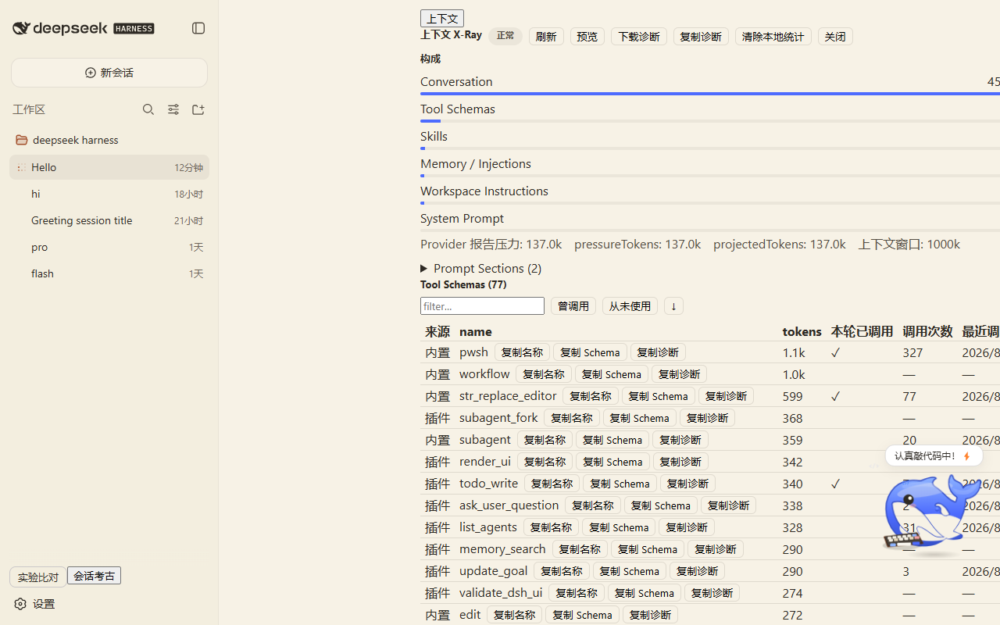
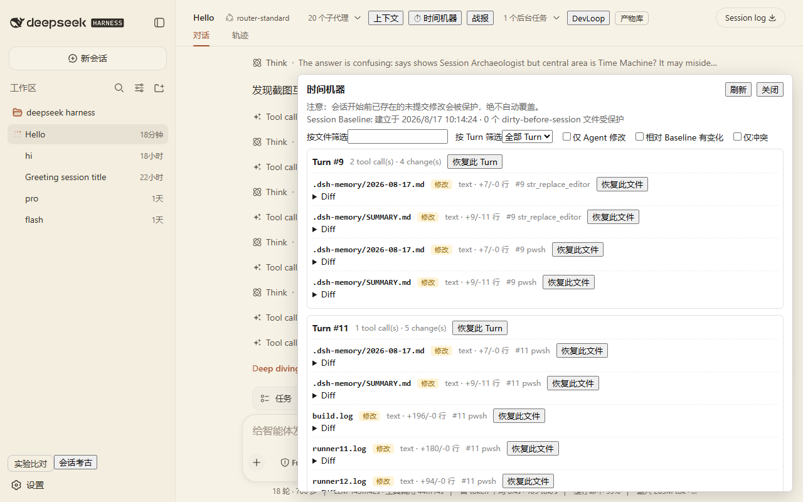
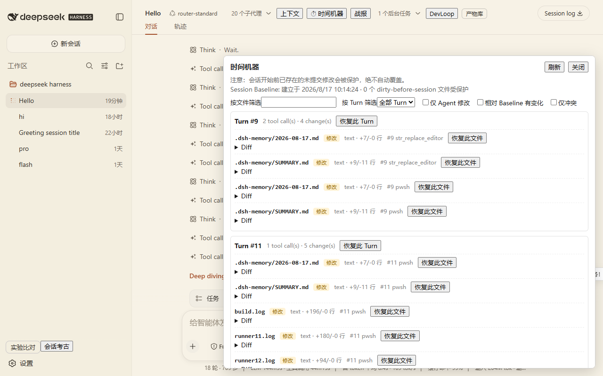
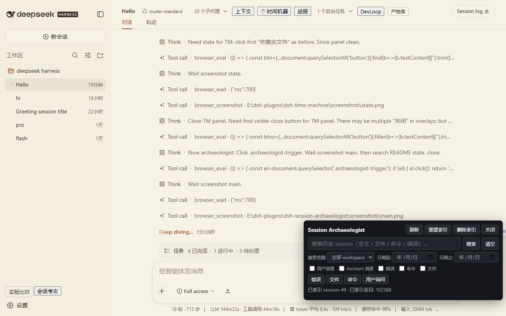
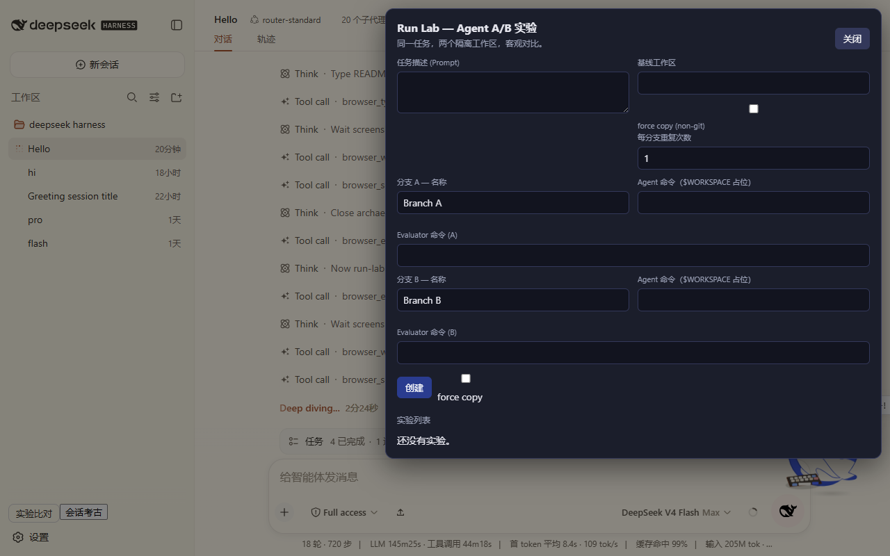
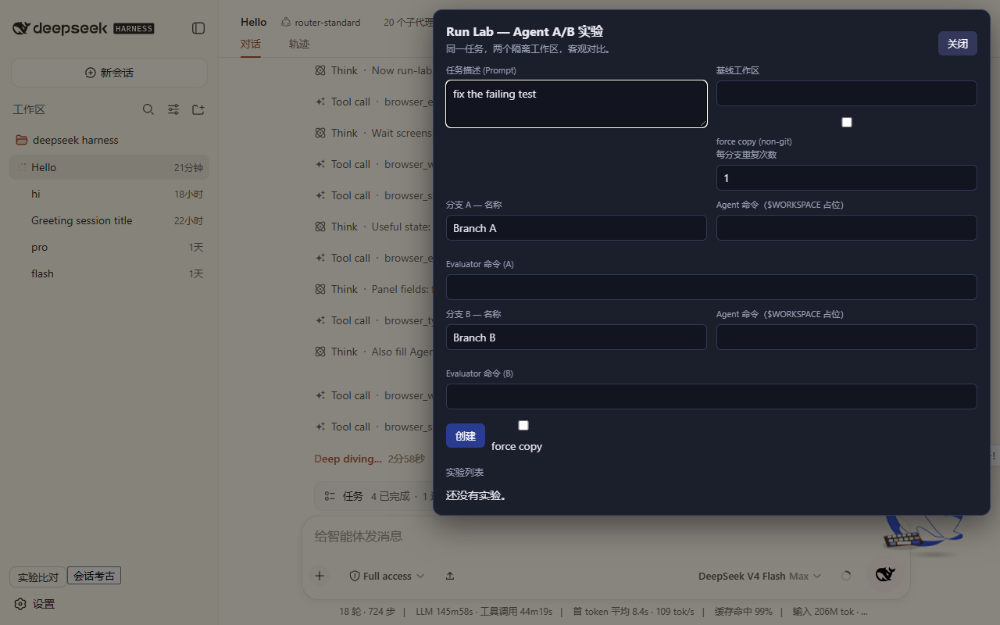
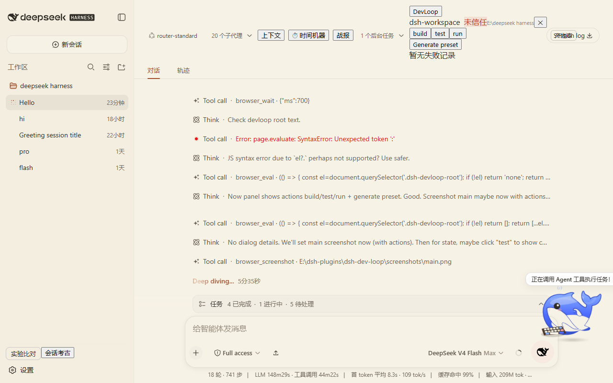
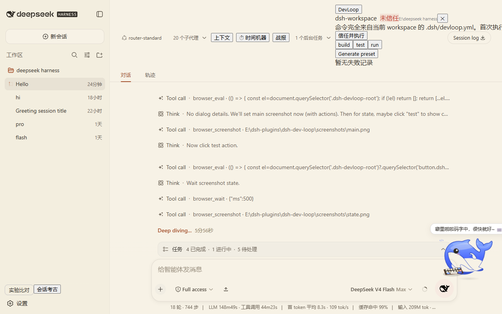
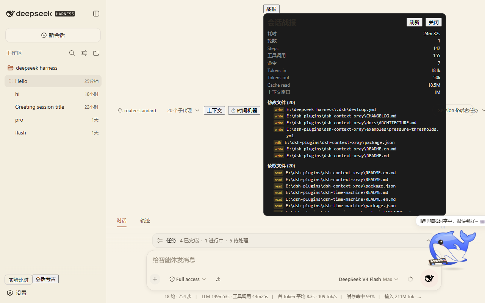
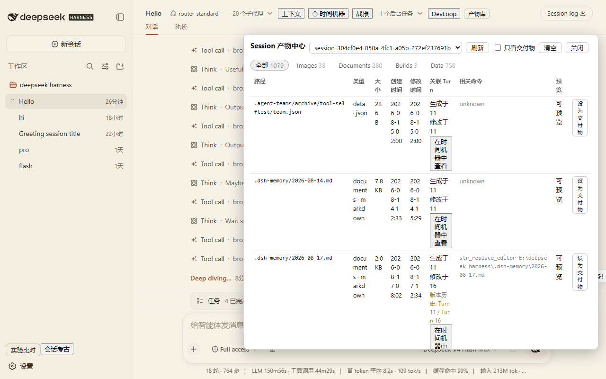

# DSH Developer Toolkit

A developer toolset for DeepSeek Harness (DSH): independent, installable plugins covering before, during, and after an agent run.

Pet Whale is a separate companion project and is not part of this toolkit.

## Toolchain Map

```
Before an agent run
  → dsh-preflight          Environment health checks, install preflight, log diagnostics

During an agent run
  → dsh-context-xray       What the model actually sees and why the context is large
  → dsh-time-machine       What files the agent changed and safe restore
  → dsh-dev-loop           Project Build/Test/Run/Restart panel

After an agent run
  → dsh-session-archaeologist   Cross-session search and timeline
  → dsh-debrief            Deterministic per-turn/per-session work summary
  → dsh-output-gallery     What the agent produced, safe previews
  → dsh-run-lab            Which agent/config performs better in isolated A/B runs
```

## Screenshots

Every plugin has real DSH Web screenshots, at least one Main UI and one useful state. This repository keeps a copy.

| Plugin | Main UI | Useful state |
|---|---|---|
| dsh-context-xray |  |  |
| dsh-time-machine |  |  |
| dsh-session-archaeologist |  |  |
| dsh-run-lab |  |  |
| dsh-dev-loop |  |  |
| dsh-debrief |  |  |
| dsh-output-gallery |  |  |

## Plugin Matrix

| Plugin | Purpose | Host | Client | Storage | Risk Level | DSH Version | Status |
|---|---|---|---|---|---|---|---|
| dsh-toolkit-ui | Unified Toolkit navigation and shared panel shell | ✅ | ✅ | no persistence | Low | `0.1.0-rc.6` | Private preview |
| dsh-preflight | Preflight checks, log diagnostics, executable fixes | ✅ | ✅ | `~/.dsh/preflight/` | Low | `0.1.0-rc.6` | Public |
| dsh-context-xray | Context composition and token diagnostics | ✅ | ✅ | `~/.dsh/context-xray/` | Low | `0.1.0-rc.6` | Private preview |
| dsh-time-machine | File history, safe restore, conflict detection | ✅ | ✅ | `~/.dsh/time-machine/` | High | `0.1.0-rc.6` | Private preview |
| dsh-session-archaeologist | Full-text session search, timeline, bring-to-context | ✅ | ✅ | `~/.dsh/session-archaeologist/` | Medium | `0.1.0-rc.6` | Private preview |
| dsh-run-lab | Isolated-workspace agent experiments and A/B | ✅ | ✅ | `~/.dsh/run-lab/` | High | `0.1.0-rc.6` | Private preview |
| dsh-dev-loop | Build/Test/Run/Restart development panel | ✅ | ✅ | `~/.dsh/dev-loop/` | Medium | `0.1.0-rc.6` | Private preview |
| dsh-debrief | Deterministic per-turn/per-session summaries | ✅ | ✅ | `~/.dsh/debrief/` | Low | `0.1.0-rc.6` | Private preview |
| dsh-output-gallery | Session artifact tracking, safe preview, deliverables | ✅ | ✅ | `~/.dsh/output-gallery/` | Medium | `0.1.0-rc.6` | Private preview |

Risk levels:

- Low: read-only diagnostics or limited metadata; no command execution
- Medium: creates local indexes, runs local commands (e.g. `pnpm test`), reads session content
- High: writes/restores files, creates isolated workspaces, runs agent commands; requires confirmation

## Install

Every plugin installs independently. Recommended flow:

```sh
git clone https://github.com/nzl153/<repo>.git
cd <repo>
pnpm install
pnpm build
dsh plugin --profile web add link:"$(cygpath -m "$PWD")"
```

The seven plugins are private previews; cloning requires GitHub access. `dsh-preflight` is public.

## Compatibility

- Tested DSH: `@deepseek-ai/dsh` `0.1.0-rc.6`
- Tested profile: `web`
- Tested platform: Windows (Git Bash / MSYS)
- Not verified on other DSH versions

## Design Principles

- Independent install/uninstall; no direct imports between plugins
- Cross-plugin integration uses HTTP API probes only and degrades silently when absent
- No modifications to DSH official source; no custom durable session events
- Metadata-only by default; no full prompts or search result bodies persisted
- Destructive operations require user confirmation

## Roadmap

- One-command aggregated installer for the whole toolkit
- Unified diagnostic export format
- Shared context summaries between plugins (still over HTTP probe protocol)
- Public curated registry submission after readiness stabilizes

## License

[MIT](LICENSE)