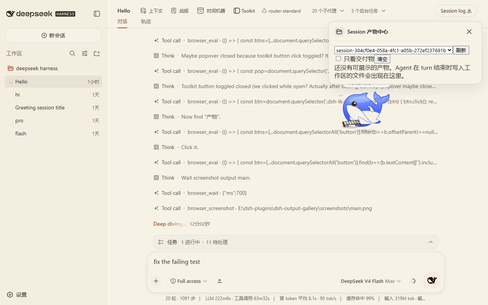

# dsh-output-gallery

Session Deliverables Gallery: automatically organizes files an agent creates or modifies per session, with safe previews and metadata-only version history.

Everything runs locally. No file contents are stored and no dangerous files are executed.

## Why

After an agent run, it is hard to tell which files were produced, which ones are final deliverables, and how many versions were created. DSH only shows produced files for the current turn.

dsh-output-gallery solves this:

- Collects artifacts automatically per session
- Shows Images / Documents / Builds / Data categories
- Lets you mark deliverables and filter by them
- Previews safely so model-generated HTML/SVG cannot execute scripts

## Features

- Automatic collection: incremental scan at turn boundaries; only files created or clearly modified after the session start and inside the workspace are collected. `node_modules`, `.git`, caches, and temp build fragments are filtered out
- Four categories: Images / Documents / Builds / Data; each item shows path / type / size / created / modified / generated & modified turn / related command / preview available
- Deliverable mode: every file can be marked as a deliverable; "deliverables only" filters pinned items. Pin state is stored in the sidecar
- Related command: identifies the latest related command from session events; shows `unknown` when not reliably detectable
- Safe previews:
  - Image thumbnails, SVG (sandbox iframe, no script execution), plain text/code, JSON tree
  - Markdown rendered as plain text (never `dangerouslySetInnerHTML` for raw Markdown)
  - HTML only inside `<iframe sandbox="">`, no script execution
  - PDF inline open/download (tracked and non-dangerous artifacts only)
  - ZIP lists entries only; never auto-extracts or executes
  - Executables (exe/msi/bat/ps1/sh/…) show metadata only, no preview or execution
- Version history (metadata): records turn points (Turn 5 / 9 / 14) when a file is modified across turns. Only size/mtime/turn are stored; file contents are not duplicated
- Config: workspace `.dsh/output-gallery.yml` can include/exclude; `~/.dsh/output-gallery/<sessionId>.json` stores sidecar metadata (previews read disk in real time)

## Relationship to official deliverables

The official `@deepseek-ai/dsh-client-ui-deliverables` in DSH rc.6 renders a single-turn produced-files line and inline references; it is client-side only and has no host-side deliverables service / HTTP API / data store.

This plugin is complementary:

- It does not duplicate the official turn-tail line or inline references
- It adds cross-turn / cross-session aggregation, version history, safe previews, sidecar storage, and include/exclude rules
- It uses its own sidecar implementation instead of extending the official model

## Screenshots




## Install

Prerequisite: DSH CLI (`@deepseek-ai/dsh`) installed and a target profile (example: `web`).

```sh
git clone https://github.com/nzl153/dsh-devtools.git
cd dsh-output-gallery
pnpm install
pnpm build
dsh plugin --profile web add link:"$(cygpath -m "$PWD")"
```

Restart `dsh web` once after install. Client-only changes then hot reload:

```sh
pnpm dev
```

## Usage

1. Install and restart DSH
2. Open the Output Gallery panel in the sidebar
3. Select a session and inspect collected artifacts
4. Mark final deliverables
5. Use safe preview to inspect content

## Development

```sh
pnpm install
pnpm dev
pnpm test
pnpm build
```

Commands:

```sh
pnpm typecheck      # tsc --noEmit
pnpm test           # vitest unit + client bundle smoke
pnpm build          # tsdown build + verify-build
pnpm e2e            # scanner+indexer E2E on a temp workspace (no DSH)
pnpm verify:hmr     # verify profile link / node_modules / DSH graph rev (DSH must be running)
```

HMR contract:

- Client-only changes: DSH runtime hot reloads automatically
- Host changes (`src/host/**`, `package.json` structure, `cordis.patch.yml`): requires DSH restart

## API

Uniform `{ ok: true, value }` / `{ ok: false, error }`; loopback + same-origin only.

- `POST /plugins/dsh-output-gallery/api/list`      `{ sessionId }`
- `POST /plugins/dsh-output-gallery/api/refresh`    `{ sessionId, turn? }`
- `POST /plugins/dsh-output-gallery/api/preview`    `{ sessionId, path }`
- `POST /plugins/dsh-output-gallery/api/pin`        `{ sessionId, path, pinned }`
- `POST /plugins/dsh-output-gallery/api/sessions`
- `POST /plugins/dsh-output-gallery/api/config`     `{ sessionId? }`
- `POST /plugins/dsh-output-gallery/api/clear`      `{ sessionId? }`
- `GET  /plugins/dsh-output-gallery/file/<path>`    static raw file (requires `x-dsh-gallery-session` header; used for inline PDF etc.)

## Compatibility

- Tested DSH: `@deepseek-ai/dsh` `0.1.0-rc.6`
- Tested profile: `web`
- Tested platform: Windows (Git Bash / MSYS)

Not verified on other DSH versions. No cross-version guarantee.

## Privacy

- Fully local; no file contents uploaded
- Sidecar stores metadata only: `~/.dsh/output-gallery/<sessionId>.json`
- Previews read disk in real time; file contents are not written into the index
- Nothing custom is appended to the DSH session durable log

## Security

Risk level: Medium (reads workspace files and previews them).

- API only accepts loopback same-origin requests; responses set `nosniff` and `no-store`
- Markdown/HTML previews never use `dangerouslySetInnerHTML` for model-generated raw content; Markdown uses plain text, HTML uses `sandbox=""` iframe
- Dangerous extensions (.exe/.msi/.bat/.ps1/.sh/.dll/…) return metadata only
- Preview reads have a byte limit (text 256KB); ZIP reads central directory entries only
- Path resolution is forced inside the workspace (prevents traversal)
- Does not execute executables and does not auto-extract ZIPs

## Limitations

- Only tracks files inside the current DSH workspace directory
- Related command shows `unknown` when not reliably detectable
- Version history is metadata-only (size/mtime/turn); old version previews are not available
- Files appear at turn boundaries, not immediately on every change
- SVG/HTML previews run in sandbox; some interactive scripts are unavailable

## Roadmap

- Content snapshots and previews for old versions
- Cross-session summary view
- Finer artifact relationship graph

None are implemented yet.

## License

[MIT](LICENSE)