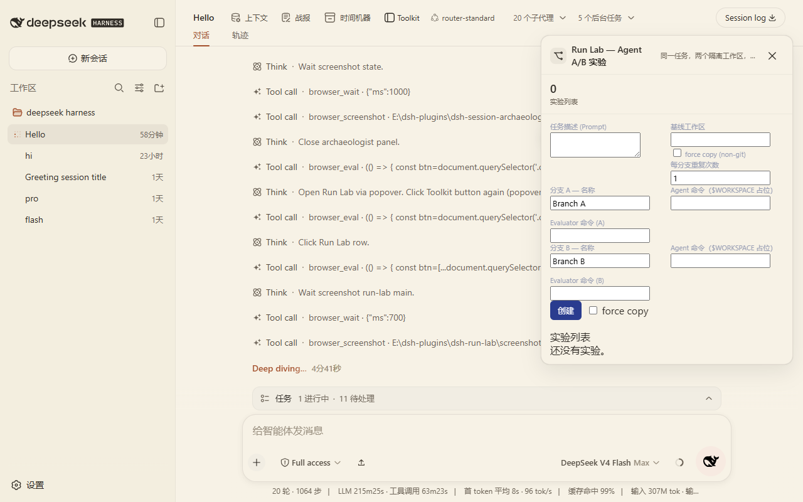
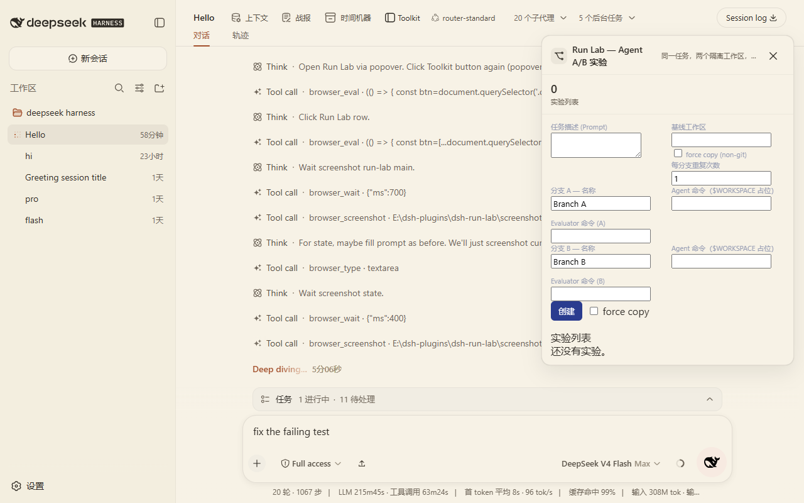

# dsh-run-lab

DSH Agent experiment and A/B comparison plugin. Run the same real coding task in two isolated workspaces, then compare with objective metrics.

The current version performs sequential repeat: A x N and B x N run serially, not concurrently. No cloud service; everything runs locally.

## Why

"Does a different model / config / prompt actually perform better?" should not be decided by gut feeling.

dsh-run-lab solves this:

- Runs the same task in isolated workspaces with a standardized flow
- Compares with the same metrics: success, wall time, turns, tokens, diff, evaluator results
- Repeats runs to show success rate and medians instead of a single lucky run

## Features

- Create Experiment A/B from a historical task or prompt
- Isolation: git repos use `git worktree add --detach <commit>`; non-git repos use directory copies (ignoring `node_modules`/`.git`/`dist` and similar large dirs)
- Agent Runner uses a unified `AgentDriver` wrapper: each branch can configure `agent` (`driver: 'command'` with command template; `$WORKSPACE` / `%WORKSPACE%` are replaced), or legacy `agentCommand`
- Evaluator: `command` + `expectExitCode` + `junitFile` + `regexAssertions` + `expectFileExists`
- Repeat: experiments support `repeat: N`; each branch runs N times serially; results aggregate success rate, median wall time, median tool calls, median input/output tokens
- Metrics: success/fail, wall time, turns, LLM calls, tool calls, input/output tokens, files changed, diff size, tests passed/failed/skipped, errors, retries, compaction count
- UI: experiment list, New Experiment (with repeat), Run A/B, side-by-side results, success rate and medians
- Manifest saved to `~/.dsh/run-lab/manifests/<id>.json`; secret fields are removed before saving

## Screenshots





## Install

Prerequisite: DSH CLI (`@deepseek-ai/dsh`) installed and a target profile (example: `web`).

```sh
git clone https://github.com/nzl153/dsh-devtools.git
cd dsh-run-lab
pnpm install
pnpm build
dsh plugin --profile web add link:"$(cygpath -m "$PWD")"
```

Restart `dsh web` once after install. Client-only changes then hot reload:

```sh
pnpm dev
```

## Usage

Minimal flow:

1. Install and restart DSH
2. Open "Experiment" panel at the bottom of the sidebar
3. Fill in prompt, baseline directory, branch agent/evaluator config, optional repeat
4. Create the experiment and click Run A/B
5. Compare success rate and median metrics

The CLI works too. Full examples live in `examples/`.

## Development

```sh
pnpm install
pnpm dev
pnpm test
pnpm build
```

Commands:

```sh
pnpm typecheck       # tsc --noEmit
pnpm test            # vitest unit + client bundle smoke
pnpm build           # tsdown three entries: lib/index.js + lib/cli.js + lib/client.js
pnpm e2e             # real E2E: temp sample repo + fake agent wrapper + repeat A/B
pnpm verify:hmr      # verify HMR wiring against a running DSH
```

HMR contract:

- Client-only changes: DSH runtime hot reloads automatically
- Host changes (`src/host/**`, `package.json` structure, `cordis.patch.yml`): requires DSH restart

## Compatibility

- Tested DSH: `@deepseek-ai/dsh` `0.1.0-rc.6`
- Tested profile: `web`
- Tested platform: Windows (Git Bash / MSYS)

Not verified on other DSH versions. No cross-version guarantee.

## Privacy

- Fully local; experiment data is not uploaded
- Manifests are saved in `~/.dsh/run-lab/manifests/<id>.json`
- Fields whose keys match token/secret/password/api-key are stripped before saving
- Nothing custom is appended to the DSH session durable log

## Security

Risk level: High (executes agent and evaluator commands in isolated workspaces).

- Experiments run only in isolated workspaces (git worktree or temporary copy); the main working tree is never touched
- Destructive replay is disabled by default; agent/evaluator commands run only inside the isolated directory
- Isolated workspaces are cleaned up after runs (`keepWorkspaces` keeps them for debugging)
- Host HTTP API uses `trustedRequest` (loopback + same origin only) with `{ ok, value }` envelopes
- Manifests are deeply sanitized before saving; secrets are not stored

## Limitations

- Sequential repeat only (A fully before B); no concurrent A/B
- Does not call the DSH internal Agent API directly; default is an external command driver. `dsh-inproc` is reserved but not wired
- DSH token metrics are marked unavailable when no official API feed exists (no faked numbers)
- JUnit parsing is lightweight: supports standard `<testsuite tests/failures/errors/skipped>`; does not cover xUnit / other XML dialects
- The default driver runs the agent as an external command; metric parsing depends on command output format

## Roadmap

- Concurrent A/B runs
- `dsh-inproc` driver using the official DSH Agent API
- Fuller JUnit / test report parsing
- Cloud dashboard and shared experiment library

None are implemented yet.

## License

[MIT](LICENSE)