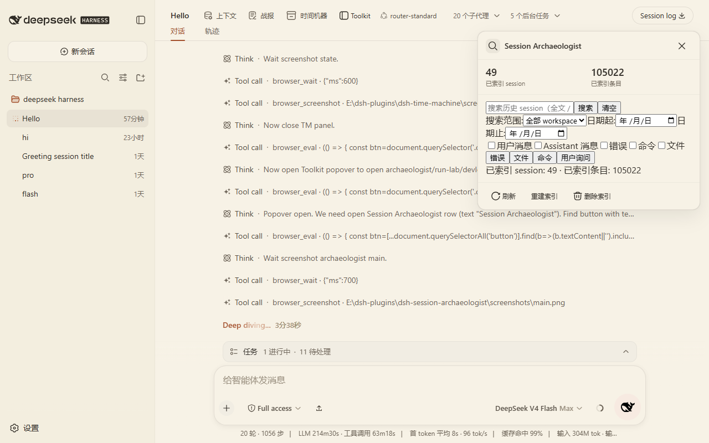
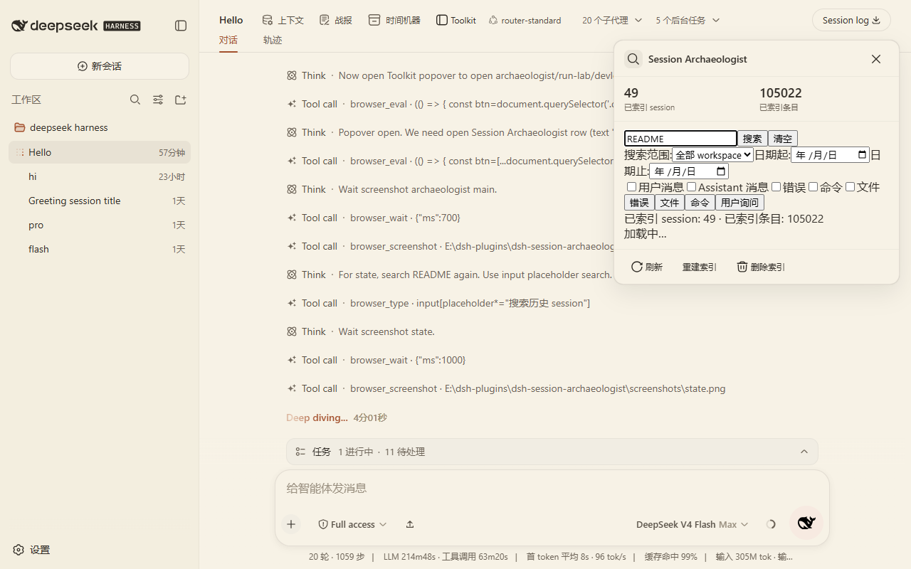

# dsh-session-archaeologist

Session Archaeologist: full-text search across local DSH history sessions and bring relevant excerpts back into the current context.

It is not a simple "session list search". It indexes user/assistant messages, tool-call summaries, filenames, commands, errors, and outcomes, using SQLite FTS5 / BM25 for local full-text search.

## Why

Old DSH sessions are a one-time asset. When you need to revisit a similar problem, the only options are memory or opening sessions one by one.

dsh-session-archaeologist solves this:

- Search all history sessions by keyword, ranked by relevance
- Filter by workspace, date, user/assistant/errors/commands/files
- Bring a bounded excerpt into the current context instead of copy-pasting

## Features

- Cross-session full-text search: `query` returns relevance-ranked results with hit fields, time, workspace, surrounding context, files, and commands
- Search scopes: Current workspace / All workspaces / Current project path / Date range / User messages / Assistant messages / Errors / Commands / Files
- Structured results: each result shows hitFields, workspace, time, session title, and surrounding context
- Timeline: generates a structured Problem → investigation → files → edits → test → result summary per session (local cache; no paid model calls)
- Bring to Current Context (multi-select): generates a bounded excerpt (estimated chars, estimated tokens, source session, date, workspace). Default budget `maxChars=8000` / `maxTokens=2000` (configurable via API); truncates above budget and never injects an entire old session
  - Add to current context: uses official DSH `agent.inject` for the live session
  - Falls back to the official input API "Send as follow-up" when no agent can receive the injection
  - Copy excerpt is one click
- Index management: Reindex / Delete index / Exclude session / Exclude workspace
- Benchmark fixture: 500 synthetic sessions; ordinary query latency <300ms

## Screenshots





## Install

Prerequisite: DSH CLI (`@deepseek-ai/dsh`) installed and a target profile (example: `web`).

```sh
git clone https://github.com/nzl153/dsh-session-archaeologist.git
cd dsh-session-archaeologist
pnpm install
pnpm build
dsh plugin --profile web add link:"$(cygpath -m "$PWD")"
```

Restart `dsh web` once after install. Client-only changes then hot reload:

```sh
pnpm dev
```

Verify:

```sh
pnpm verify:hmr
```

## Usage

1. Install and restart DSH
2. Reindex first (build the local SQLite FTS5 index)
3. Enter a keyword in the search panel and set scopes
4. Select relevant excerpts and generate a bounded excerpt
5. Add to current context or copy the excerpt

## Development

```sh
pnpm install
pnpm dev
pnpm test
pnpm build
```

Commands:

```sh
pnpm typecheck   # tsc --noEmit
pnpm test        # vitest unit + jsdom smoke
pnpm build       # tsdown → lib/index.js + lib/client.js
node scripts/bench.mjs  # generate fixture and run search latency benchmark
```

HMR contract:

- Client-only changes: DSH runtime hot reloads automatically
- Host changes (`src/host/**`, `package.json` structure, `cordis.patch.yml`): requires DSH restart

## API

- `POST /plugins/dsh-session-archaeologist/api/search` `{ query, limit?, filters? }`
  - `filters`: `sessions[]`, `workspaces[]`, `projectPath`, `after`, `before`, `source[]`, `excludeSessions[]`, `excludeWorkspaces[]`
- `POST .../excerpt` `{ selections: [{ sessionId, hitIds }], maxChars?, maxTokens?, contextRadius? }` — multi-session multi-select; returns bounded excerpt (charCount/tokenEstimate/sources/truncated)
- `POST .../context` `{ sessionId, text, mode?: 'inject'|'steer' }` — send to current session through official agent API
- `POST .../index`, `.../reindex`, `.../delete-index`
- `POST .../exclude`, `.../timeline`

## Compatibility

- Tested DSH: `@deepseek-ai/dsh` `0.1.0-rc.6`
- Tested profile: `web`
- Tested platform: Windows (Git Bash / MSYS)

Not verified on other DSH versions. No cross-version guarantee.

## Privacy

- Fully local; no external network
- Index and cache only in `~/.dsh/session-archaeologist/index.db`
- Index source is the session persistence files under `~/.dsh` (JSONL/zstd)
- Nothing custom is appended to the DSH session durable log

## Security

Risk level: Medium.

- Reads: local session file content and builds a local index
- Writes: `~/.dsh/session-archaeologist/index.db`; can inject text into the current session or send follow-up via official agent API
- Executes: no external commands
- Injection has a budget cap (default 8000 chars / 2000 tokens); never injects an entire old session
- Cold archived sessions cannot be injected; falls back to queued message
- Does not modify DSH official source

## Limitations

- Indexing is incremental; first index of a large directory may take time
- FTS5 is keyword/BM25 relevance, not semantic search
- Semantic layer (embedding vector search / rerank) is not implemented
- Session files that cannot be parsed are skipped and recorded
- Add to current context requires the target session to be live in the current process; cold archived sessions fall back to queued messages
- Benchmark data is a synthetic fixture, not a real corpus

## Roadmap

- Optional semantic layer: local embeddings (e.g. `node-llama-cpp` or SQLite vector extension) and rerank; FTS5/BM25 remains the default
- Requires larger runtime dependencies and a trade-off on index size and first-build cost
- `buildMultiExcerpt` and `SearchFilters` extension points are already reserved

None are implemented yet.

## License

[MIT](LICENSE)