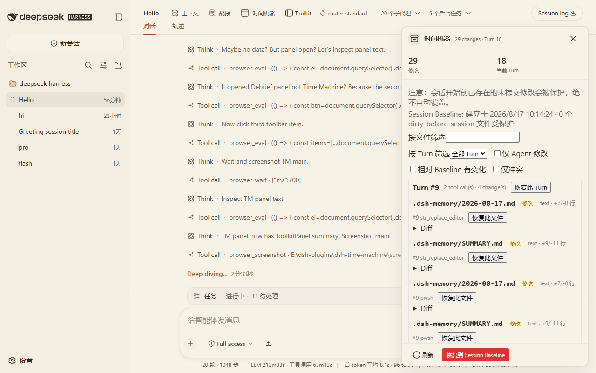
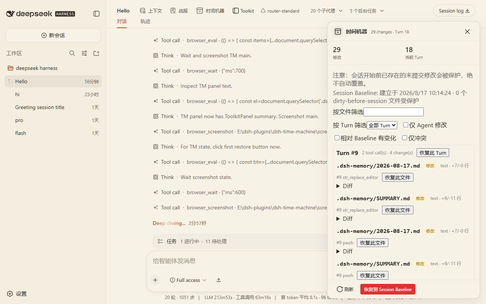

# dsh-time-machine

DSH Agent 文件修改时间机器：自动记录 agent 对 workspace 的修改，按 Turn 展示 timeline/diff，支持安全恢复。

## Why

Agent 改文件很快，但改了什么、能不能回到之前的样子，DSH 本身不提供。

dsh-time-machine 解决的问题：

- Agent 这一 turn 动了哪些文件
- 改动前后内容是什么
- 不小心改坏了，能不能安全恢复
- 恢复时会不会覆盖你已有的手动修改

## Features

- Session Baseline：session 第一次出现文件修改时自动建立基线，记录文件 hash、是否原本存在、Git 状态、session 开始前已有的 dirty files
- Turn 修改记录：通过 DSH 官方 `tools/pre-execute` / `tools/post-execute` hook 在相关工具调用前后增量扫描 workspace，记录新增 / 修改 / 删除 / 重命名、+/- 行数、修改时间、tool call 来源、diff
- Watcher 辅助层：用 Node 内置 `fs.watch` 做快速发现（仅提示），配 debounce/合并去重；真正一致性由 scan 保证
- Rename detection：old.ts → new.ts 相同 size、hash 相同或内容相似度达到阈值时识别为 rename，UI 显示 `old → new`
- 安全恢复：默认先 Preview，真正写回必须再次确认；恢复前重新 hash，冲突即 CONFLICT，绝不自动覆盖
- Conflict UI：View conflict、Copy old version、Restore to new file、Force overwrite
- Timeline filters：按 file、按 turn、仅 Agent 修改、仅冲突、相对 baseline 有变化
- Git 只读：只用只读 Git 命令，绝不执行破坏性命令

## Screenshots





## Install

前置条件：已安装 DSH CLI（`@deepseek-ai/dsh`），且本机已有目标 profile（示例为 `web`）。

```sh
git clone https://github.com/nzl153/dsh-time-machine.git
cd dsh-time-machine
pnpm install
pnpm build
dsh plugin --profile web add link:"$(cygpath -m "$PWD")"
```

装完重启 `dsh web`。之后 client-only 改动走 HMR：

```sh
pnpm dev
```

## Usage

1. 安装并重启 DSH
2. 在 Agent 工作的 workspace 打开 Time Machine 面板
3. 查看 Session Baseline 与 Turn 列表
4. 点击某个 turn 或文件查看 diff
5. 需要恢复时选择 Restore → 先 Preview → 确认写回
6. 遇到冲突时按 UI 提示选择处理方式

## Development

```sh
pnpm install
pnpm dev
pnpm test
pnpm build
```

要求：Node.js >= 22（本项目用 Node 24、pnpm 11 验证）。

工程命令：

```sh
pnpm typecheck       # tsc --noEmit
pnpm test:unit       # Vitest 单元测试
pnpm test:smoke      # client bundle 加载契约
pnpm test:e2e        # 真实临时 Git 仓库跑 core 引擎，不启动 DSH
pnpm test            # unit + smoke + E2E
pnpm build           # tsdown 双 half + scripts/verify-build.mjs
pnpm verify:hmr --profile=web
```

HMR 约定：

- client-only 改动：DSH 运行时 HMR 自动生效
- host 改动（`src/host/**`、`package.json` 结构、`cordis.patch.yml`）：需要重启 DSH

## Compatibility

- 测试过的 DSH：`@deepseek-ai/dsh` `0.1.0-rc.6`
- 测试过的 profile：`web`
- 测试过的平台：Windows（Git Bash / MSYS）
- Node.js：>= 22

未在其他 DSH 版本上验证，不承诺跨版本兼容。

## Privacy

- 所有数据本地保存，不联网
- 快照与历史存放在 `~/.dsh/time-machine/<sessionId>/`
- 文件内容使用 content-addressed object store
- 为支持恢复 baseline，会保存 workspace 中小于阈值（默认 1 MiB）的文本文件内容；这是必要取舍
- 二进制与大文件只记录 hash，不保存内容
- 不向 DSH Session log 追加自定义事件

## Security

风险等级：High（会写回文件）。

### 绝不自动做

1. 绝不覆盖用户原有未提交修改：baseline 中标记为 `dirtyBeforeSession` 的文件，恢复时一律拒绝（`dirty-before-session`）
2. 绝不在未确认时写回：所有恢复操作先 `preview`，写回必须由客户端显式传 `confirmed: true`
3. 绝不覆盖冲突：当前磁盘 hash 与插件记录的最新状态不一致时标记 `CONFLICT`，不写回；如需覆盖必须显式 `force:true`（客户端二次 confirm + host 复核）
4. 绝不删除 Agent 未创建的文件：baseline 中已存在的文件，若恢复目标为“删除”（如回 baseline 时文件被 agent 删除），拒绝操作（`agent-did-not-create`）
5. 绝不调用破坏性 Git 命令：`git reset --hard`、`git clean -fd`、`git checkout .` 等一律不使用

### 需要确认的操作

- Restore this file → Preview → 确认后写回
- Restore this turn → Preview → 确认后写回
- Restore to session baseline → Preview → 确认后写回
- Force overwrite conflict → Preview → 二次确认 → host `confirmed:true, force:true`

## Limitations

- 二进制与大文件只记录 hash，无法内容恢复（预览显示 `content-not-stored`）
- 默认忽略目录：`node_modules`、`.git`、`build`、`dist`、`.dsh`、`.venv`、`venv`；可通过 `src/core/engine.ts` 的 `EngineConfig` 调整
- Watcher 只是快速发现提示，最终一致性靠 scan；错过/漏报 watcher 事件不会丢记录，只是延后到下次 scan 才入库
- 「仅冲突」筛选在客户端是近似实现（展示 modified/deleted/renamed 高风险项）；精确冲突需执行 preview
- Restore to new file 默认写到 `<rel>.tm-conflict`，避免覆盖用户手动版本
- 只跟踪 DSH 当前 workspace 目录内的文件

## Roadmap

- 二进制 / 大文件内容恢复的可选开关
- 跨 session 的全局 timeline
- 更细粒度的 watcher 事件合并配置

以上均未实现。

## License

[MIT](LICENSE)